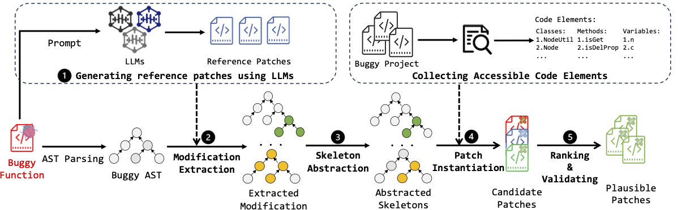

# GiantRepair

Artifact for ICSE 2025 Submission: GiantRepair

* [I. Introduction](#i-introduction)
* [II. Project Structure](#ii-project-structure)
* [III. Environment](#iii-environment)
* [IV. How to Run](#iii-how-to-run)
* [V. Discussion Results](#iv-discussion-result)

## I. Introduction

Automated Program Repair (APR) has garnered significant attention due to its potential to streamline the bug repair process for human developers. Recently, LLM-based APR methods have shown promise in repairing real-world bugs. However, existing APR methods often utilize patches generated by LLMs without further optimization, resulting in reduced effectiveness due to the lack of program-specific knowledge. Furthermore, the evaluations of these APR methods have typically been conducted under the assumption of perfect fault localization, which may not accurately reflect their real-world effectiveness. To address these limitations, this paper introduces an innovative APR approach called **GIANTREPAIR**. Our approach leverages the insight that LLM-generated patches, although not necessarily correct, offer valuable guidance for the patch generation process. Based on this insight, **GIANTREPAIR** first constructs patch skeletons from LLM-generated patches to confine the patch space, and then generates high-quality patches tailored to specific programs through context-aware patch generation by instantiating the skeletons. To evaluate the performance of our approach, we conduct two large-scale experiments. The results demonstrate that **GIANTREPAIR** not only effectively repairs more bugs (an average of 27.78% on Defects4J v1.2 and 23.40% on Defects4J v2.0) than using LLM-generated patches directly, but also outperforms state-of-the-art APR methods by repairing at least 42 and 7 more bugs under perfect and automated fault localization scenarios, respectively.

## II. Project Structure

TBD

## III. Environment

### GiantRepair

* OS: Linux (Tested on Ubuntu 20.04.6 LTS)
* OpenJDK 1.8.0_382 and OpenJDK 11.0.20.1
* Download and configure Defects4J.
* More runtime configurations can be found in the config-file.

### LLM

* Python==3.9
* transformers==4.33.3 

## III. How to Run

TBD

## IV. Discussion Result

### Experiment with the GPT-4-1106-preview

To investigate whether or not GiantRepair is still effective for repairing unique bugs when comparing to the most advanced LLMs, we conducted another experiment with GPT-4.Specifically, we randomly selected ten bugs that were correctly repaired by GIANTREPAIR but cannot by the studied LLMs, and then invoked GPT-4 via API requests to generate 20 patches for each bug. Here is the outcome table:

| Bug ids            | Closure-19   | Closure-36   | Closure-113  | Lang-57      | Math-27      | Math-85      | Cli-32       | Codec-4      | Compress-1   | Jsoup-33     |
| ------------------ | ------------ | ------------ | ------------ | ------------ | ------------ | ------------ | ------------ | ------------ | ------------ | ------------ |
| GPT-4-1106-preview | $\checkmark$ | $\times$     | $\times$     | $\times$     | $\times$     | $\times$     | $\times$     | $\times$     | $\times$     | $\times$     |
| GiantRepair        | $\checkmark$ | $\checkmark$ | $\checkmark$ | $\checkmark$ | $\checkmark$ | $\checkmark$ | $\checkmark$ | $\checkmark$ | $\checkmark$ | $\checkmark$ |

### Data leakage

In Discussion's Data leakage part, we not only showcase GiantRepair's effectiveness in addressing data leakage concerns by examining the StarCoder training dataset, but we also seek to further substantiate this conclusion. To achieve this, we employed the [GrowingBugs](https://github.com/liuhuigmail/GrowingBugRepository) dataset for additional experimentation. Remarkably, GiantRepair managed to successfully rectify 10 out of the 51 bugs identified. The detailed data are presented in the tables below:

| Project                  | Bugs\#SF | GiantRepair |
| ------------------------ | -------- | ----------- |
| Canvas\_api              | 2        | 1           |
| Dosgi\_common            | 1        | 1           |
| Hono\_client             | 2        | 0           |
| Tika\_app                | 1        | 1           |
| HttpClient5              | 2        | 0           |
| JacksonDatatypeJsr310    | 1        | 0           |
| JacksonModuleAfterburner | 1        | 1           |
| Switchyard\_admin        | 1        | 1           |
| Qpidjms\_client          | 1        | 0           |
| Tiles\_api               | 1        | 0           |
| Tiles\_core              | 2        | 0           |
| Wicket\_request          | 5        | 0           |
| Wicket\_util             | 4        | 1           |
| Wicket\_spring           | 1        | 0           |
| Struts1\_core            | 2        | 0           |
| Wicket\_core             | 10       | 2           |
| Cargo\_container         | 3        | 0           |
| Jcodemodel               | 1        | 1           |
| Vectorz                  | 2        | 0           |
| Restfixture              | 2        | 0           |
| Xades4j                  | 1        | 0           |
| Render\_app              | 1        | 0           |
| Leshan\_core             | 4        | 1           |
| Total                    | 51       | **10**      |
